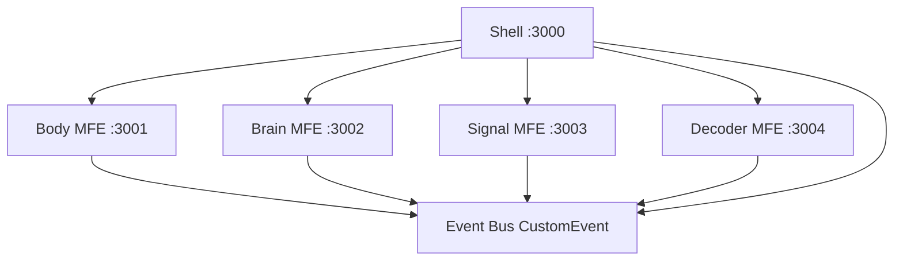

# NeuroMFE Lab

**Micro Frontends + Brain Computer Interface Simulation**

Simulación educativa de Brain Computer Interface basada en patrones EEG sintéticos.

Esta aplicación **no** es un dispositivo médico, **no** lee pensamientos y **no** realiza diagnósticos.

## Objetivo

Demostrar en una sola PoC funcional:

1. Arquitectura de Micro Frontends reales con Module Federation.
2. Flujo conceptual de una BCI de motor imagery sobre EEG sintético.

## Qué demuestra

- Un Shell que carga cuatro remotes independientes.
- Comunicación desacoplada por eventos de dominio.
- Generación EEG (C3, Cz, C4) con ERD simulado.
- Pipeline DSP real: DC, filtro 8–30 Hz, FFT, potencia Mu/Beta, clasificador heurístico.
- Modo Explorar y modo BCI ciego.
- Modo Arquitectura, Event Monitor y tolerancia a fallos.

## Arquitectura



## Tecnologías

React 18, TypeScript strict, Vite 6, `@module-federation/vite`, pnpm workspaces, CSS Modules, Canvas, `fft.js`, Vitest, Playwright.

## Micro Frontends

| App | Puerto | Responsabilidad |
| --- | --- | --- |
| Shell | 3000 | Composición, modos, architecture mode, error boundaries |
| Body | 3001 | Selección de tarea motora y silueta SVG |
| Brain | 3002 | Vista educativa del cerebro y electrodos |
| Signal | 3003 | EEG sintético, calibración y osciloscopio |
| Decoder | 3004 | Features, clasificador heurístico y comando |

El Shell **no** importa código fuente de los remotes. Los consume por Module Federation (`body_mfe/BodyApp`, etc.).

## Brain Computer Interface

En Explorar, el usuario elige mano derecha, mano izquierda, pies o reposo. Signal genera EEG. Decoder clasifica a partir de la señal, no del botón.

En BCI, Signal elige una clase secreta. El Decoder solo recibe la ventana EEG. El ground truth se revela **después** de `CLASSIFICATION_RESULT`.

## Cómo funciona la simulación EEG

250 Hz, 2 s, canales C3/Cz/C4. La señal combina ritmos Mu (~10 Hz), Beta (~20 Hz), deriva, 60 Hz y ruido. El ERD reduce Mu/Beta en el canal asociado a la clase.

## Cómo ejecutar

```bash
pnpm install
pnpm dev
```

## Puertos

- Shell: http://localhost:3000
- Body: http://localhost:3001
- Brain: http://localhost:3002
- Signal: http://localhost:3003
- Decoder: http://localhost:3004

## Cómo ejecutar cada MFE

Cada remote es una aplicación independiente. Abrir su puerto muestra `Standalone Micro Frontend`.

```bash
pnpm --filter @neuromfe/body-mfe dev
```

## Cómo ejecutar tests

```bash
pnpm test
pnpm test:e2e
```

## Cómo hacer build

```bash
pnpm build
```

`pnpm validate` ejecuta typecheck, lint, tests unitarios y build.

## Modo arquitectura

El toggle **Arquitectura** dibuja los límites de cada remote, su puerto y el Event Monitor.

## Cómo demostrar tolerancia a fallos

Ver [docs/DEMO-SCRIPT.md](docs/DEMO-SCRIPT.md): detener `brain-mfe`, recargar el Shell y comprobar el fallback.

## Despliegue

Builds estáticos independientes. Configurar `VITE_*_REMOTE_URL` con las URLs de cada `remoteEntry.js`. Detalle en [docs/DEPLOYMENT.md](docs/DEPLOYMENT.md).

## Limitaciones

- EEG 100 % sintético.
- Clasificador heurístico, no machine learning.
- Tres canales y cuatro clases educativas.
- Sin hardware, dataset real ni backend.

## Disclaimer educativo

NeuroMFE Lab es una simulación educativa. Las señales mostradas son sintéticas y no corresponden a mediciones clínicas ni permiten realizar diagnósticos.
