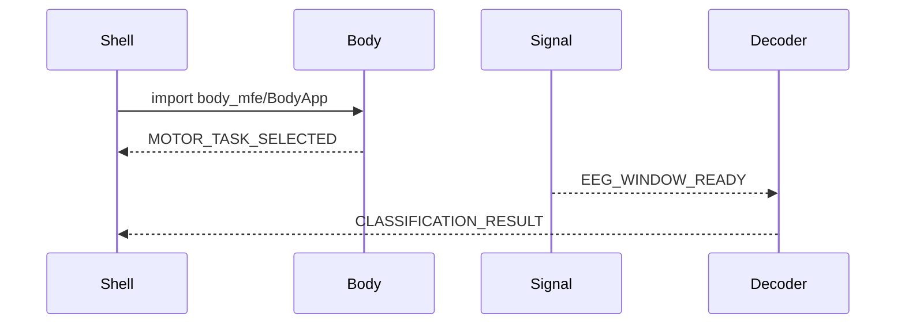

# Arquitectura — NeuroMFE Lab

## Por qué Micro Frontends

La PoC debe demostrar que una interfaz unitaria puede componerse con aplicaciones independientes: equipos, ciclos de release y fallos aislados. Un único bundle React no permite esa conversación.

## Shell

El Shell (`apps/shell`) es el host. Compone layout, modos Explorar/BCI, architecture overlay, Event Monitor y Error Boundaries. No genera EEG ni clasifica.

## Remotes

Body, Brain, Signal y Decoder son Vite apps con su propio `package.json`, puerto y `remoteEntry.js`. Cada una puede abrirse standalone.

## Module Federation

`@module-federation/vite` expone `./BodyApp`, `./BrainApp`, `./SignalApp` y `./DecoderApp`. El Shell los carga con `React.lazy`. React y React DOM son singletons compartidos. Las URLs se leen de `VITE_*_REMOTE_URL`.

## Bounded contexts

- Body: interacción motora.
- Brain: visualización cortical educativa.
- Signal: adquisición sintética.
- Decoder: DSP + decisión.
- contracts: tipos y bus, sin lógica de un MFE.

## Comunicación por eventos

`CustomEvent` en `window`, API tipada `publish` / `subscribe`. No hay store React compartido. `EEG_WINDOW_READY` no incluye `MotorTask`.

## Aislamiento

Un remote puede fallar: `RemoteErrorBoundary` muestra fallback y el resto continúa. No hay imports entre `apps/*`.

## Despliegue independiente

Cada app genera un `dist/` estático. El Shell apunta a los `remoteEntry.js` de producción mediante variables de entorno.

## Dependencias compartidas

React singleton evita dos copias del renderer. `contracts` y `dsp` se empaquetan por app; el bus usa el DOM, no un singleton de módulo.

## Ventajas

Equipos autónomos, demo de fallos parciales, URLs distintas, bounded contexts claros.

## Trade-offs

Más complejidad de tooling, HMR entre remotes limitado, versionado de contratos, latencia de carga inicial.

## Riesgos

Cambiar el contrato de eventos rompe remotes. URLs mal configuradas dejan un hueco en el layout (esperado y visible). Duplicar React rompería hooks: por eso es singleton.
